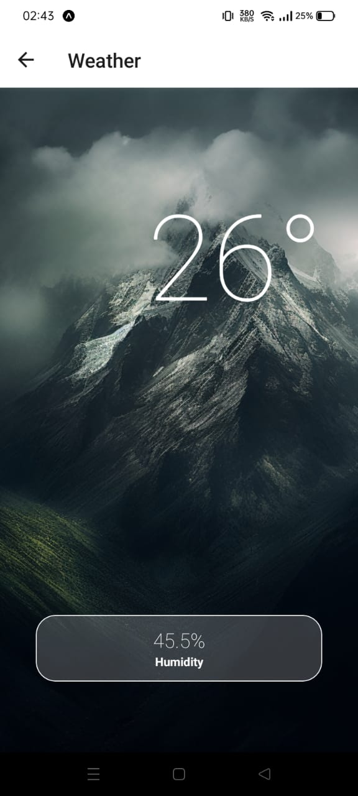

# SmartEnvControl

SmartEnvControl is a versatile smart device project that combines a React Native mobile app with Arduino code. This project enables you to monitor environmental conditions, control connected machines remotely, and prioritize user well-being with a dynamic dark/light mode for optimal viewing comfort. Firebase Realtime Database is used for seamless data synchronization between the app and connected devices.

## Features

- **Environmental Monitoring:**
  - Real-time temperature and humidity tracking for your surroundings.

- **Remote Machine Control:**
  - Seamlessly control connected machines through the React Native app.

- **User Well-being:**
  - Dynamic dark/light mode to prioritize optimal viewing comfort.

- **Firebase Realtime Database:**
  - Synchronize data in real-time between the React Native app and connected devices.



## Getting Started

Follow these instructions to get a copy of the project up and running on your local machine for development and testing purposes.

### Prerequisites

- [Node.js](https://nodejs.org/)
- [React Native CLI](https://reactnative.dev/docs/environment-setup)
- [Arduino IDE](https://www.arduino.cc/en/software)
- [Firebase Account](https://firebase.google.com/)

### Installation

1. Clone the repository:

   ```bash
   git clone https://github.com/Hama02/SmartEnvControl.git
   cd SmartEnvControl
